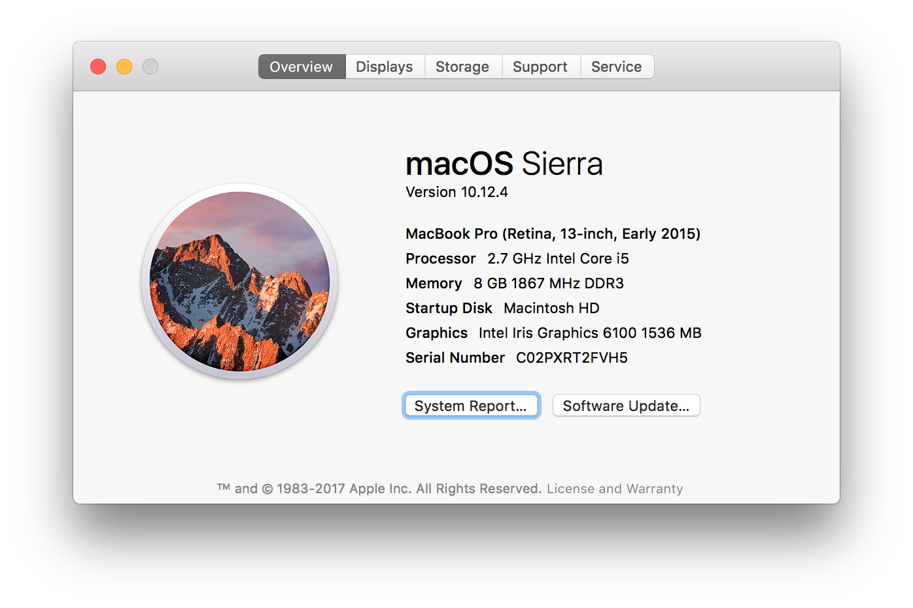
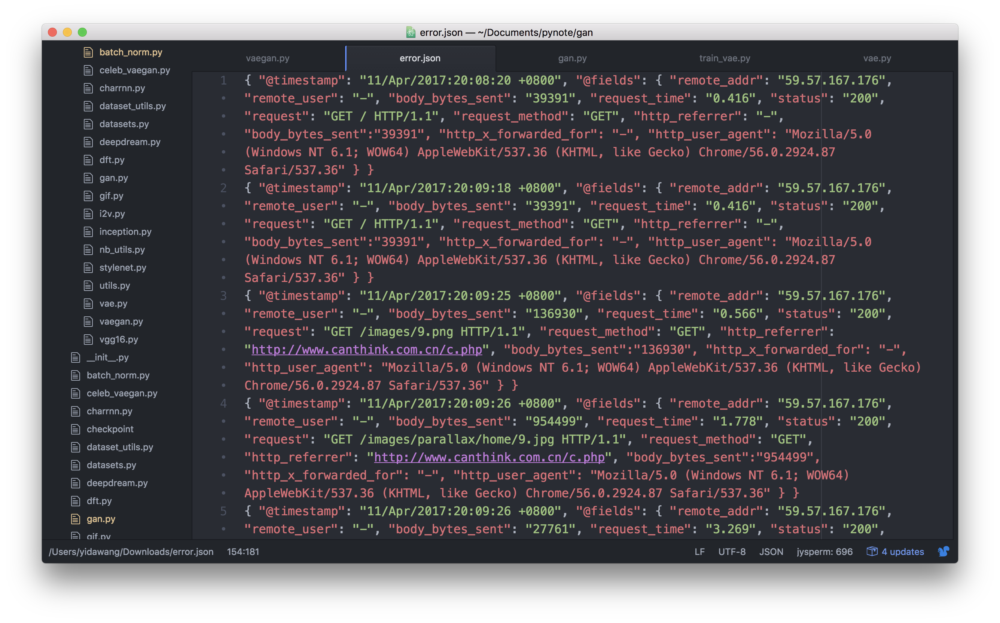
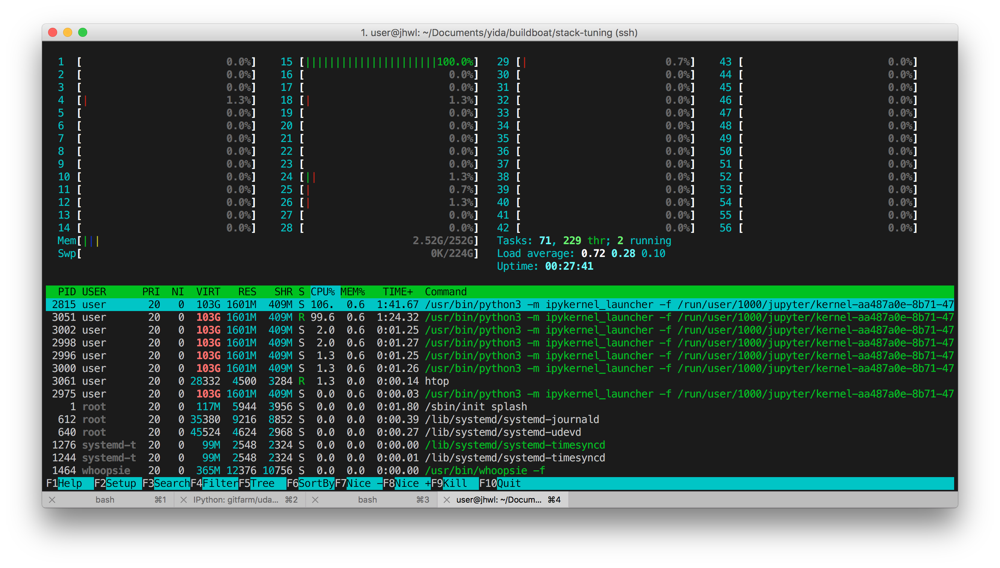
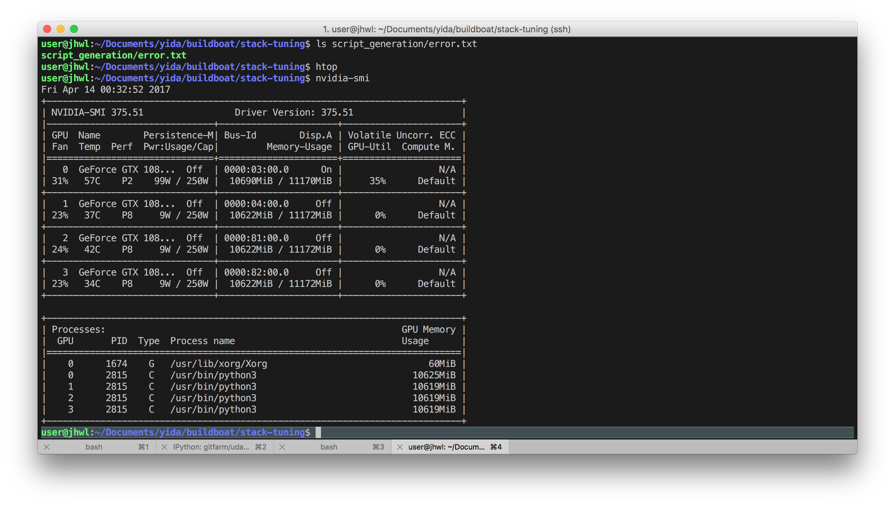
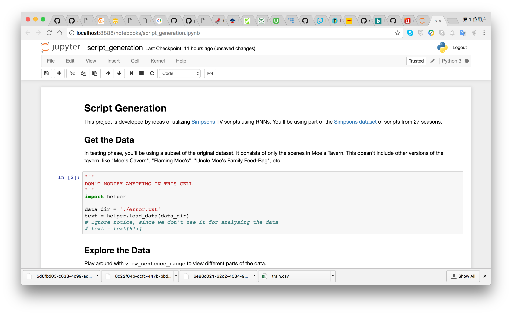
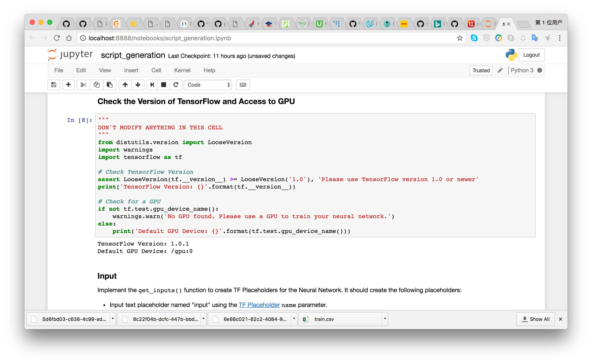
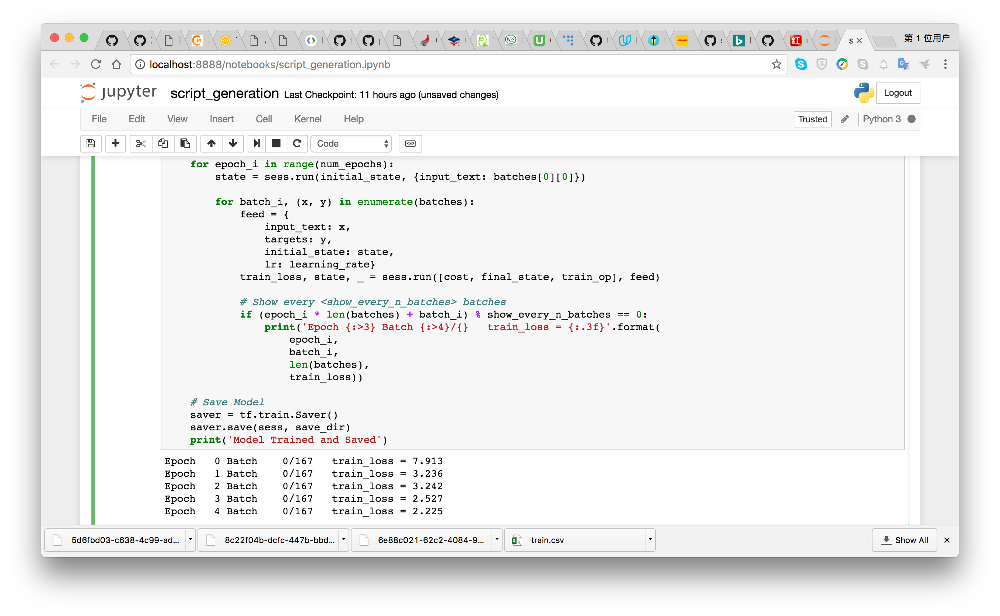
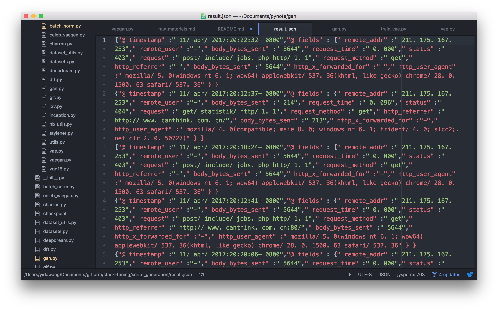

# _Canthink Cyber Security Toolkits_

## Canthink Script Generation for HTTP Request

Copyright (c) 2017, Yida Wang, Canthink, All rights reserved.

Use of this source code is governed by a BSD-style license that can be found in the LICENSE file.

## Server Setting

This could be installed on Windows, Linux and Unix based OS, our initial version is carried out on Ubuntu and Mac OS.

### Ubuntu

Install screen and ssh for remote control and background monitoring.

`sudo apt-get install htop screen ssh`

More modern versions of Ubuntu you could just install `pip` via, it works on my Ubuntu 16.04:

`sudo apt-get install python-dev python-virtualenv python-pip python3-pip`

## CentOS

Coming soon.

## MacOS

Coming soon.

# TensorFlow Setting

## Information

You can find installing information for Linux system on official website of [TensorFlow](https://www.tensorflow.org/install/install_linux).

## Nvidia Support(optional)

NVIDIA requirements to run TensorFlow with GPU support

`sudo apt-get install libcupti-dev`

Install the nvidia drivers for Ubuntu (for 14.04 and newer), firstly add the graphics-drivers ppa:

`sudo add-apt-repository ppa:graphics-drivers/ppa sudo apt-get update`

Then install the recommended driver

`sudo ubuntu-drivers autoinstall`

Then restart your system.

Install CUDA 8, you can also find information on [Nvidia-CUDA](https://developer.nvidia.com/cuda-downloads) website.

Downloading script:

`wget http://developer.download.nvidia.com/compute/cuda/repos/ubuntu1604/x86_64/cuda-repo-ubuntu1604_8.0.61-1_amd64.deb`

Installation Instructions:

`sudo dpkg -i cuda-repo-ubuntu1604_8.0.61-1_amd64.deb`

`sudo apt-get update`

`sudo apt-get install cuda`

## Install TensorFlow

`pip install --upgrade tensorflow` # for Python 2.7

`pip3 install --upgrade tensorflow` # for Python 3.n

`pip install --upgrade tensorflow-gpu` # for Python 2.7 and GPU

`pip3 install --upgrade tensorflow-gpu` # for Python 3.n and GPU

# Install Server and Client Monitor

## Installing Jupyter Notebook

As an existing Python user, you may wish to install Jupyter using Python's package manager, pip, instead of Anaconda.

First, ensure that you have the latest pip; older versions may have trouble with some dependencies:

`pip3 install --upgrade pip`

Then install the Jupyter Notebook using:

`pip3 install jupyter`

# Remote Access to IPython Notebooks via SSH

Here I took a reference on blog in [Coderwall](https://coderwall.com/p/ohk6cg/remote-access-to-ipython-notebooks-via-ssh)

Scenario: On your local computer, you want to open and manipulate an IPython notebook running on a remote computer. We will do this by opening an SSH tunnel. This tunnel will forward the port used by the remotely running IPython instance to a port on the local machine, where it can be accessed in a browser just like a locally running IPython instance.

--------------------------------------------------------------------------------

On the remote machine, start the IPython notebooks server:

`remote_user@remote_host$ ipython notebook --no-browser --port=8889`

Usually IPython opens a browser to display the available notebooks, but we do not need that so we use the option --no-browser. We also change the port to 8889, for no other reason than to show how this is done.

On the local machine, start an SSH tunnel:

`local_user@local_host$ ssh -N -f -L localhost:8888:localhost:8889 remote_user@remote_host`

The first option -N tells SSH that no remote commands will be executed, and is useful for port forwarding. The second option -f has the effect that SSH will go to background, so the local tunnel-enabling terminal remains usable. The last option -L lists the port forwarding configuration (remote port 8889 to local port 8888).

Now open your browser on the local machine and type in the address bar

`localhost:8888`

which displays your remotely running IPython notebook server. To close the SSH tunnel on the local machine, look for the process and kill it manually:

`local_user@local_host$ ps aux | grep localhost:8889`

Alternatively, you can start the tunnel without the -f option. The process will then remain in the foreground and can be killed with ctrl-c.

On the remote machine, kill the IPython server with ctrl-c ctrl-c.

# Platform Information

## Training Data

## Server Status

Server Status of CPU 

Server Status of GPU 

## Client

Input Definition 

GPU Information of Server 

Training Progress 

## Result

### Training

Raw materials from http requests in `json` files, some keywords such as status and other activities are regarded as targets while the remaining parts are just raw materials for training fed in deep neural networks.

### Testing

Predicted data from http requests in `json` files in the future, such prediction including everything in the inputs are utilized as a whole part for activity analysis afterwards.

